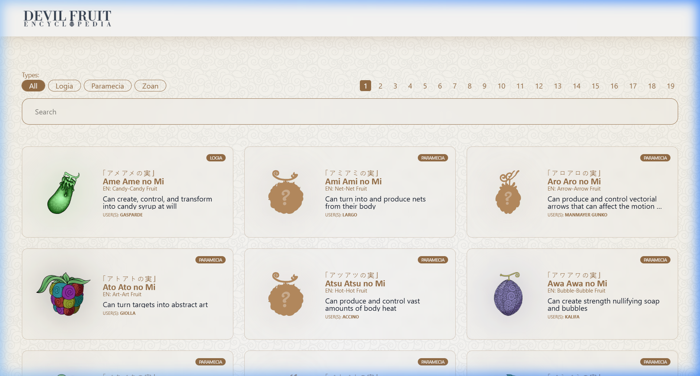
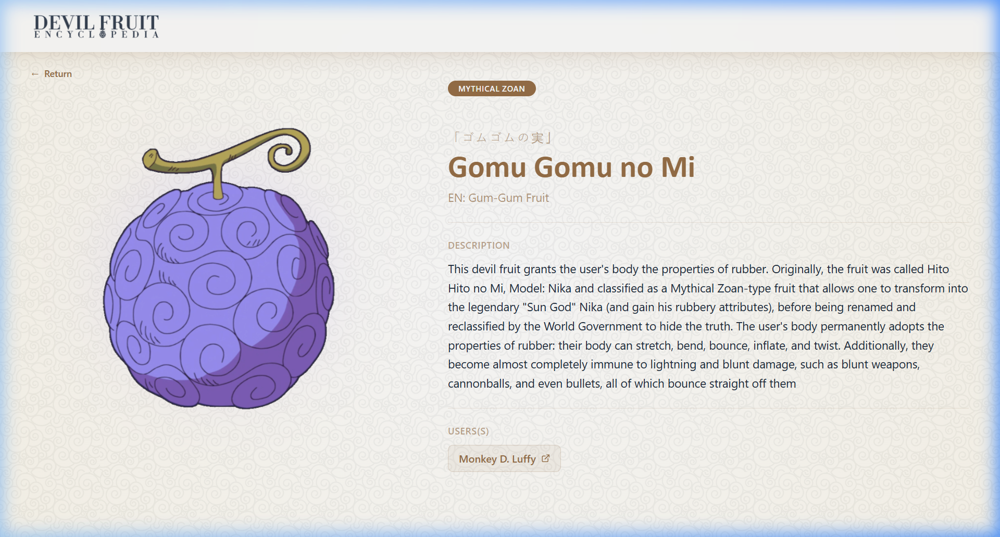

<p align="center">
  
</p>

<p align="center">
  <strong>悪魔の実図鑑 — Akuma no Mi Zukan</strong><br/>
  An interactive encyclopedia cataloguing every Devil Fruit from the One Piece universe.
</p>

<p align="center">
  <a href="https://devilfruitencyclopedia.vercel.app">Live Demo</a>
</p>

---

## Screenshots

| Catalog | Detail Page |
|---------|-------------|
|  |  |

---

## Tech Stack

| Technology | Version | Purpose |
|---|---|---|
| [React](https://react.dev/) | 19 | UI library with React Compiler enabled |
| [Tailwind CSS](https://tailwindcss.com/) | 4 | Utility-first CSS framework |
| [React Router](https://reactrouter.com/) | 7 | Client-side routing |
| [Vite](https://vite.dev/) | 8 | Build tool & dev server |
| [React Compiler](https://react.dev/learn/react-compiler) | 1.0 | Automatic memoization via Babel plugin |
| [Vercel](https://vercel.com/) | — | Deployment & hosting |

---

## Features

### 🗂️ Fruit Catalog
- Browse through **224 Devil Fruits** with image, Japanese name (furigana), English name, excerpt, type badge, and user(s)
- Cards display SVG and PNG fruit illustrations with dynamic color-based glow effects using CSS `color-mix()` and `drop-shadow`

### Search
- Real-time search across fruit names (JP & EN), and owners
- Accent-insensitive search (e.g. searching "Goro" finds "Gorō")
- Popover-based results dropdown with instant navigation

### Category Filters
- Filter by type: **All**, **Logia**, **Paramecia**, **Zoan** (including Mythical Zoan subtypes)
- Active filter state reflected visually with styled buttons

### Pagination
- Paginated catalog (12 fruits per page) with page numbers
- Pagination automatically recalculates and resets to page 1 when changing category filters

### Individual Fruit Page
- Dedicated route for each fruit (`/fruta/:id`)
- Large floating fruit illustration with animated levitation effect
- Dynamic color glow based on the fruit's dominant color
- Full description, type badge, Japanese name with ruby annotations
- Owner links to the One Piece Wiki with external link icons
- Smooth enter animation and sticky image on desktop

### Design & UI
- Custom warm color palette centered around `#976f47` (golden brown)
- Subtle background pattern overlay using AVIF texture
- Glassmorphism header with `backdrop-blur`
- SVG fruit illustrations rendered with CSS `mask-image` and `mix-blend-mode: screen` for colorization
- CSS Anchor Positioning for dynamically placed elements
- Ruby annotations (`<ruby>`) for Japanese names above Latin names
- `selection:bg` custom text selection color
- Responsive layout: 3 columns → 2 columns → 1 column

### Animations
- **Intro splash screen**: Full-screen logo with pulse animation, auto-dismisses after 2s (shown once per session via `sessionStorage`)
- **Fruit float**: Infinite subtle vertical floating animation on detail page
- **Page transitions**: Fade-in + slide-up enter animation on fruit detail page
- **Hover states**: Color transitions on cards, buttons, and links

### Responsive Design
- Fully responsive from mobile to ultrawide (`xxs` to `4xl` breakpoints)
- Custom Tailwind breakpoints: `xxs: 500px`, `cl: 960px`, `lpt: 1366px`, `1xl: 1470px`, `4xl: 1600px`
- Adaptive grid layout and sticky image behavior on desktop

---

## Project Structure

```
akuma-no-mi-zukan/
├── public/
│   ├── images/fruits/        # 224 fruit illustrations (PNG & SVG)
│   ├── favicon.svg
│   └── icons.svg
├── src/
│   ├── assets/
│   │   ├── akumanomi.json    # Main dataset (224 fruits)
│   │   ├── full-logo.webp    # Splash screen logo
│   │   ├── h-logo.webp       # Header logo
│   │   └── pattern.avif      # Background texture
│   ├── components/
│   │   ├── Header.jsx        # Fixed glassmorphism header
│   │   ├── Intro.jsx         # Splash screen (first visit)
│   │   ├── ANMList.jsx       # Catalog with search, filters, pagination
│   │   ├── AkumaNoMi.jsx     # Individual fruit card (popover variant)
│   │   └── FruitPage.jsx     # Full detail page (/fruta/:id)
│   ├── App.jsx               # Routes & layout
│   ├── App.css               # Legacy styles
│   ├── index.css             # Tailwind + custom CSS (animations, masks)
│   └── main.jsx              # Entry point with BrowserRouter
├── scripts/
│   └── extract-colors.mjs    # Utility to extract dominant colors from fruit images
├── vite.config.js
└── package.json
```

---

## Getting Started

### Prerequisites

- [Node.js](https://nodejs.org/) ≥ 18

### Installation

```bash
# Clone the repository
git clone https://github.com/brunofranciscojs/akuma-no-mi-zukan.git
cd akuma-no-mi-zukan

# Install dependencies
npm install

# Start development server
npm run dev
```

The app will be available at `http://localhost:5173`.

### Build for Production

```bash
npm run build
npm run preview
```

---

## Deployment

The project is deployed on **Vercel** at [devilfruitencyclopedia.vercel.app](https://devilfruitencyclopedia.vercel.app).

For SPA routing to work correctly on Vercel, add a `vercel.json`:

```json
{
  "rewrites": [
    { "source": "/(.*)", "destination": "/" }
  ]
}
```

---

## Data

Each fruit in `akumanomi.json` contains:

```json
{
  "id": "ANM40",
  "name": "Gomu Gomu no Mi",
  "type": "Mythical Zoan",
  "engName": "Gum-Gum Fruit",
  "jpName": "ゴムゴムの実",
  "desc": "Full description...",
  "excerpt": "Short summary...",
  "localImg": "ANM40.png",
  "owner": "Monkey D. Luffy",
  "color": "#887acb"
}
```

---

## License

This project is for educational and fan purposes only. One Piece and all related content are owned by Eiichiro Oda and Shueisha.

---

<p align="center">
  Made with ❤️ by <a href="https://github.com/brunofranciscojs">brunofranciscojs</a>
</p>
